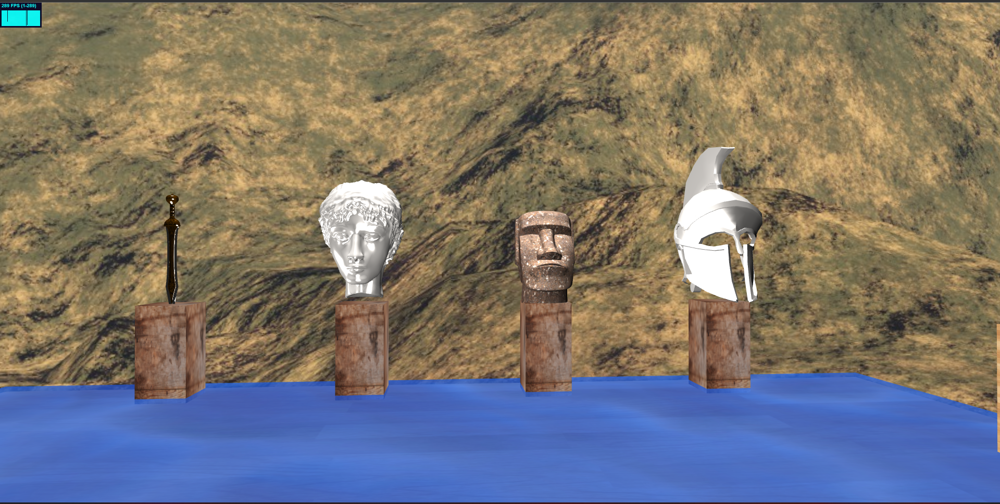
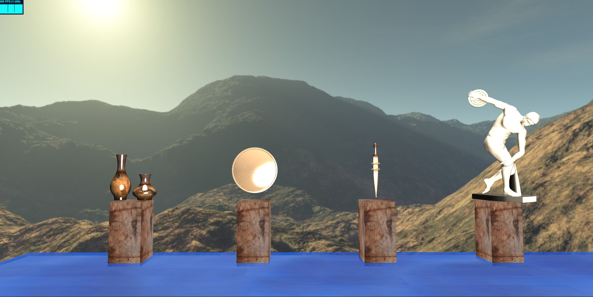
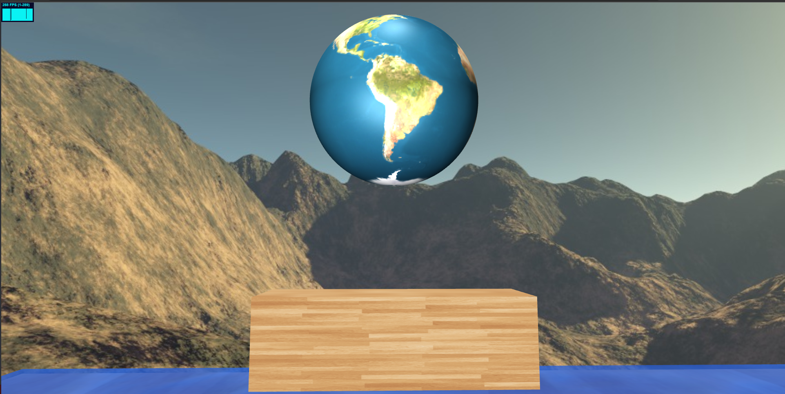

# Authors
- Berkay OZEK
- Berke OCAL

# Art Gallery THREE.JS
This project is made by using THREE.JS. There are various artifacts such as weapons,shields,
armor, sculptures and statues from ancient Greece. Most of the artifacts are retrieved from
dig sites, thanks to generous funding’s. The gallery continues to collect various artifacts
around the globe to provide a satisfactory and noteworthy collection for history lovers and
ancient Greece enthusiasts.

### Light, Skybox, Texture Mapping:
Initially, we added skybox. First light implementation was a directional light. However, we observed room was not
illuminated enough for a clear view. Hence, we added point light in the middle of
the room. Texture mapping is used on Earth globe.
### Animated objects:
Earth globe and discus throwing statue are animated. Globe rotates on Y axis, statue rotates on Z axis. This process is implemented in update
function. Globe rotates as follows: earthMash.rotateY(0.0015). Animated objects
are stored in an array. For every animated object in the array, we perform rotation
on their respective axis’s.
### Shaders:
We acquired a water shader online. Shader has cloud png to simulate wave animation. In order to simulate wave animation, we execute the following
code in the update function: customUniforms.time.value += 0.002.

### Controls
FPS camera can be controlled by using PointerLockControls script.
- First click on the screen for controlling.
- W: Forward
- A: Left
- D: Right
- S: Backward
- Mouse: Adjusting rotation

# Screenshots

